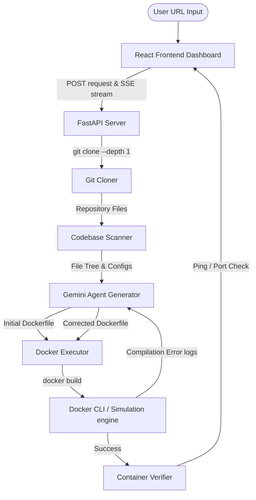

# DockerForge — AI-Powered Dockerfile Generator

DockerForge is an agentic AI developer tool that accepts a public GitHub repository, clones it, scans its structure and configuration files, generates an optimized Dockerfile, builds the image, verifies that the container successfully boots and responds to health checks, and self-corrects up to 3 times if compilation or runtime errors are encountered.

---

## 🏗️ Architecture

The system consists of a FastAPI backend (orchestration + execution engine) and a React dashboard (live scrolling terminal and visual step timeline).



### Component Details
1. **FastAPI Server (`backend/main.py`)**: Defines routes to initiate forge requests and hosts a thread-safe AsyncIO Queue to pipe live console logs to clients via Server-Sent Events (SSE). It also serves the built static React assets for unified deployment.
2. **Git Cloner & Scanner (`backend/agent.py`)**: Performs light Git checkouts (depth=1) and scans configuration locks (e.g. `package.json`, `requirements.txt`, `go.mod`) to build codebase context.
3. **Agent Reasoning Engine (`backend/agent.py`)**: Uses Google Gemini to draft base images, manage package caching layers, detect container ports, analyze build crash logs, and apply drop-in corrections.
4. **Command Executor (`backend/docker_executor.py`)**: Dual-mode engine. If Docker is installed locally, it runs real subprocess builds. Otherwise, it triggers a high-fidelity Simulation Sandbox simulating package installations, compiler crashes, and self-correcting logic.

---

## 🛠️ Setup Instructions

### Option 1: Run with Docker (Recommended)
You can run the entire unified stack (frontend + backend) out-of-the-box using the provided multi-stage Dockerfile or Docker Compose.

**Using Docker Compose**:
```bash
# Set your Gemini API Key in the environment (or pass it in the UI input)
export GEMINI_API_KEY="your-api-key"

# Build and start the container
docker compose up --build
```
Open `http://localhost:8000` to view the application.

*Note: The container mounts the host's Docker socket `/var/run/docker.sock` allowing DockerForge to execute real builds on the host daemon from inside the container.*

---

### Option 2: Local Development Setup
If you want to run the frontend and backend servers separately:

#### 1. Backend (FastAPI)
```bash
cd backend

# Create a virtual environment and activate it
python -m venv venv
source venv/bin/activate  # On Windows: .\venv\Scripts\activate

# Install dependencies
pip install -r requirements.txt

# Start the development server
uvicorn main:app --reload --host 127.0.0.1 --port 8000
```

#### 2. Frontend (React + Vite)
```bash
cd frontend

# Install dependencies
npm install

# Run the dev server (proxies '/api' calls to FastAPI port 8000)
npm run dev
```
Open `http://localhost:5173` to access the dashboard.

---

## 🤖 LLM Provider Selection
DockerForge is powered by **Google Gemini** (`gemini-1.5-flash` or `gemini-2.5-flash`) via the Google Generative AI Python SDK.

### Why Google Gemini?
1. **High Speed & Low Latency**: Generation completes in seconds, which is crucial for a real-time terminal experience.
2. **Large Context Window**: Codebase file structures and dependency tree configuration files can get large; Gemini's context window handles these effortlessly.
3. **Strict JSON Schema Constraints**: Enables outputting structured JSON responses natively without brittle regular expression matching.
4. **Robust Free/Developer Tier**: Easy sandbox testing without early token limit barriers.

---

## ⚠️ Known Limitations & Edge Cases

1. **Private Repositories**: Only public repositories are supported for cloning. Accessing private repos requires git credential helper access or PAT token configurations in the host environment.
2. **Interactive CLI Processes**: Build processes that require interactive terminal prompts (such as `y/n` package confirmations) will time out or fail. Always enforce quiet flags (e.g., `-y` or `--non-interactive`) in Dockerfiles.
3. **Hardware Architecture Bindings**: If a project compiles native binary dependencies, the built image is bound to the architecture of the builder host (e.g. x86_64 vs arm64/Apple Silicon) unless cross-compilers are specified.
